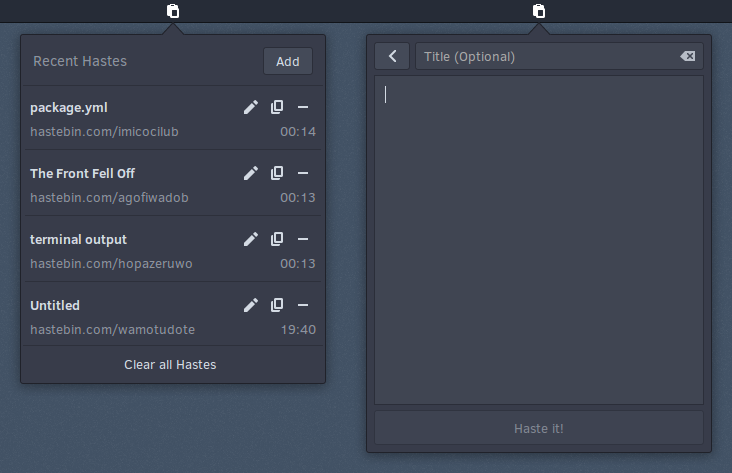

# budgie-haste-applet
A Budgie applet for pasting text to any haste server.

[](https://paypal.me/StefanRic)

---

### Dependencies
```
vala
gtk+-3.0
gio-unix-2.0
libpeas-1.0
PeasGtk-1.0
budgie-1.0
libsoup-2.4
```

These can be installed on Solus by running:  
`sudo eopkg it vala budgie-desktop-devel libsoup-devel`

### Installing
```
./autogen.sh --prefix=/usr
make
sudo make install
```
#### Solus
You can install budgie-haste-applet from the Software Centre or via the command line:
```
sudo eopkg it budgie-haste-applet
```

#### Arch Linux
The package can be installed on Arch using
```
yaourt -S haste-applet
```

---

### Screenshot

