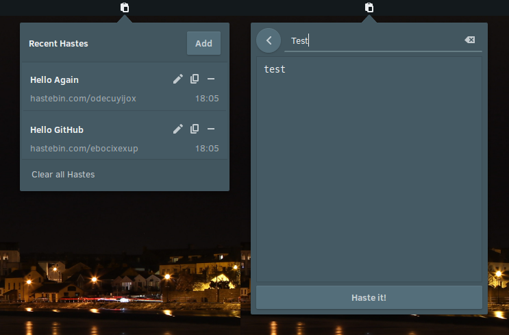

# haste-applet
A Budgie applet for the haste service.

---

### Dependencies
```
vala
gtk+-3.0
gio-unix-2.0
libpeas-1.0
PeasGtk-1.0
budgie-1.0
libsoup-2.4
```

These can be installed on Solus by running:  
`sudo eopkg it vala libgtk-3-devel glib2-devel libpeas-devel budgie-desktop-devel libsoup-devel`

### Installing
```
./autogen.sh --prefix=/usr
make
sudo make install
```

The package can be installed on Arch using 
```
yaourt -S haste-applet
```

A package in the Solus repo will soon be available.

---

### Screenshot

