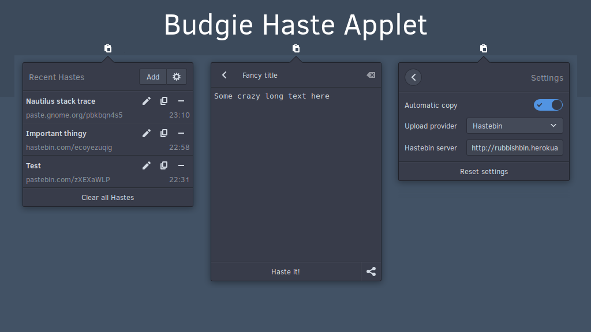

# Budgie Haste Widget
Post any text, be it code or prose, to various services directly from your desktop. Made with ❤ for Budgie Desktop.

Buy me a beer/a coffee/love?  
[](https://paypal.me/StefanRic)



---

## Dependencies
```
budgie-1.0 >= 2
gtk+-3.0
libsoup-2.4
vala
```

These can be installed on Solus by running:  
```bash
sudo eopkg it vala budgie-desktop-devel libsoup-devel`
```

### Installing

**From source**  
```bash
mkdir build && cd build
meson --prefix /usr --buildtype=plain ..
ninja
sudo ninja install
```

**Solus**  
You can install budgie-haste-applet from the Software Centre or via the command line:
```bash
sudo eopkg it budgie-haste-applet
```